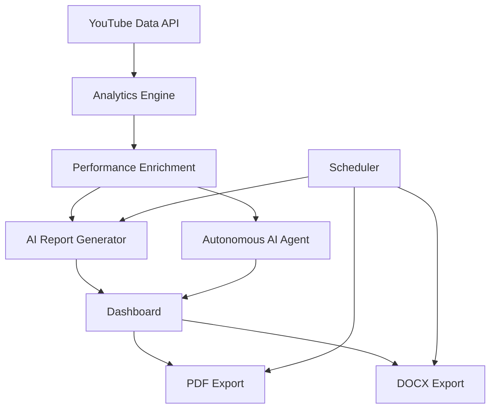

# MoveUp Media - Autonomous AI Content Operations Platform

Enterprise-grade AI-powered YouTube analytics, operational intelligence, and autonomous media reporting platform built for MoveUp Media.

This platform automates YouTube performance analysis, AI-generated executive reporting, conversational intelligence workflows, competitive benchmarking, and scheduled operational reporting pipelines.

---

## Live Objectives

MoveUp Media manages multiple YouTube channels and spends several hours every week manually:

- Collecting analytics
- Monitoring video performance
- Writing operational summaries
- Identifying underperforming content
- Detecting growth opportunities
- Creating strategic recommendations

This platform fully automates that workflow using AI, analytics, and autonomous operational intelligence.

---

## Core Deliverables Achieved

### Automated YouTube Analytics Collection

- Fetches the latest 10 videos per channel
- Collects views, likes, comments, and engagement metrics
- Processes multi-channel analytics

### AI-Powered Operational Intelligence

- Executive-level AI reports
- Performance classification
- Strategic recommendations
- Growth opportunity detection
- Engagement analysis

### Autonomous Conversational AI Agent

- Natural language querying
- Intent routing
- Dynamic analytics reasoning
- Multi-channel comparison
- Operational insights generation

### Enterprise Management Dashboard

- Executive overview
- Analytics intelligence
- Competitive benchmarking
- AI reporting
- Interactive charts
- Export system

### Autonomous Scheduling System

- Weekly automated report generation
- Scheduled analytics pipelines
- Automated PDF and DOCX exports
- Logging and monitoring

---

## Supported Channels

| Channel | URL |
| --- | --- |
| Netflu | [Netflu](https://www.youtube.com/@Netflu) |
| ThePlayoffsTV | [ThePlayoffsTV](https://www.youtube.com/@ThePlayoffsTV) |

The platform analyzes the latest 10 videos from each channel.

---

## Competitive Benchmarking

The platform includes competitive benchmarking against similar media and sports content channels to identify:

- Engagement positioning
- Audience growth comparison
- Performance opportunities
- Content market positioning

This extension demonstrates business-context operational thinking beyond the core assignment.

---

## AI Features

### AI Operational Intelligence Reports

The platform generates enterprise-grade AI reports including:

- Executive Summary
- Strongest Videos
- Underperforming Videos
- Engagement Intelligence
- Audience Behavior Analysis
- Content Trend Detection
- Strategic Recommendations
- Weekly Priority Actions

## Conversational Intelligence System

Users can interact with the platform using natural language.

Example queries:

- Which channel performed better this week?
- What content themes generate the highest engagement?
- Which videos are underperforming?
- What should we optimize next week?
- Compare both channels operationally
- Which uploads have weak audience resonance?

The system autonomously:

- Detects user intent
- Routes analytical workflows
- Fetches relevant context
- Generates strategic responses

---

## Technical Architecture

### Frontend / Management Platform

- Streamlit
- Plotly
- Pandas

### AI / LLM

- Google Gemini
- Prompt-engineered operational intelligence workflows

### Data Source

- YouTube Data API v3

### Automation

- APScheduler

### Reporting

- python-docx
- fpdf2

### Analytics Engine

- Custom performance scoring
- Engagement intelligence
- Momentum analytics
- Audience signal analysis
- Growth velocity tracking

---

## System Architecture



---

## Key Enterprise Features

### Performance Intelligence

- Engagement rate analysis
- Growth momentum detection
- Audience resonance scoring
- Content efficiency metrics
- Operational risk detection

### AI Operations Layer

- Autonomous routing engine
- Prompt-engineered reporting
- Conversational operational analytics
- Context-aware strategic responses

### Production Engineering

- Caching layer
- Fallback data mode
- Export pipeline
- Scheduler automation
- Runtime monitoring
- Environment configuration management

---

## Dashboard Modules

### Executive Overview

- KPI cards
- Channel health monitoring
- Top-performing content
- Operational alerts

### Analytics Intelligence

- Performance score analysis
- Engagement trend visualization
- Classification distribution
- Scatter intelligence charts

### AI Operational Reports

- AI-generated executive analysis
- Structured strategic reporting
- Downloadable reports

### Competitive Benchmarking 2

- Competitor analytics
- Comparative positioning
- Market intelligence

### Autonomous AI Assistant

- Conversational operational analytics
- Dynamic query routing
- AI reasoning engine

---

## Important Technical Note

The public YouTube Data API does not expose:

- CTR
- Audience retention
- Watch-time analytics

without authenticated YouTube Analytics API OAuth access.

To address this limitation, the platform estimates:

- Retention signals
- Audience resonance
- Engagement quality
- CTR probability

using:

- Engagement velocity
- Interaction ratios
- Growth momentum
- Performance scoring

---

## Installation

### 1. Clone Repository

```bash
git clone <your-public-github-repo>
cd moveup-content-ops-bot
```

### 2. Create Virtual Environment

#### Windows

```bash
python -m venv venv
venv\Scripts\activate
```

#### Linux / Mac

```bash
python3 -m venv venv
source venv/bin/activate
```

### 3. Install Dependencies

```bash
pip install -r requirements.txt
```

### 4. Configure Environment Variables

Create a `.env` file:

```env
YOUTUBE_API_KEY=your_youtube_api_key
GEMINI_API_KEY=your_gemini_api_key

PRIMARY_MODEL=gemini-1.5-flash
FALLBACK_MODEL=gemini-1.5-flash

ENABLE_CACHE=true
ENABLE_AUTOMATION=true
ENABLE_BENCHMARKING=true
```

---

## Running The Platform

### Launch Dashboard

```bash
streamlit run streamlit_app/dashboard.py
```

### Run Autonomous Pipeline

```bash
python -m app.automation.report_pipeline
```

### Run Scheduler

```bash
python -m app.automation.scheduler
```

---

## Export System

The platform supports:

- Enterprise PDF reports
- DOCX executive reports
- Automated scheduled exports

Generated reports are stored inside:

```plaintext
reports/
```

---

## Operational Automation

The scheduler automatically:

- Fetches analytics
- Generates AI reports
- Exports documents
- Logs operations

without manual intervention.

---

## Error Handling and Resilience

The platform includes:

- AI quota protection
- Fallback sample datasets
- Caching system
- API failure handling
- Session persistence
- Runtime monitoring

---

## Tested Scenarios

- Multi-channel analytics
- Competitive benchmarking
- AI report generation
- Autonomous conversational queries
- Export generation
- Scheduler execution
- Fallback dataset loading
- API quota handling
- Dashboard rerender stability

---

## Cloud Deployment

The platform is deployment-ready for:

- Streamlit Cloud
- Render
- Railway
- VPS environments

---

## Demo

Add your Loom demo link or deployment URL here.

---

## Author

Ishan Kaushik

AI Automation and Operations Engineer

---

## Assignment Alignment

This submission satisfies:

- Automated YouTube analytics collection
- AI-powered operational reporting
- Management platform requirement
- Autonomous conversational agent
- Competitive benchmarking extension
- Automated scheduling extension
